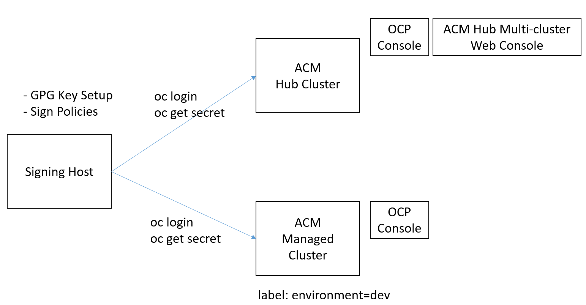

# Prepare Test Enviornment to test IShield with RHACM

### Goal:
- User can setup a test environment in which IShield can be tested with RHACM.

### Prerequisite: 
- Minimum two OpenShift Clusters: ACM HUB Cluster and a ACM Managed Cluster attached to it.
- Host Machine (to clone ACM policy collection locally and sign and deploy policies to to ACM Hub Cluster)
- OC CLI enabled on Host machine
- GPG installed on Host machine
 
### Action Steps:

Complete the following steps:

1. Open command console (`OC-Hub`) for connecting to ACM Hub Cluster via `oc`
2. Open another command console (`OC-MANAGED`) for connecting to ACM Managed Cluster via `oc`
3. Open ACM HUB Cluster Multcluster WebConsole
4. Choose a signer email (e.g signer@enterprise.com)
5. Setup GPG keys as described in [doc](../prerequisite-setup/GPG_KEY_SETUP.md)

### Simple Illustration of a Test Environoment

