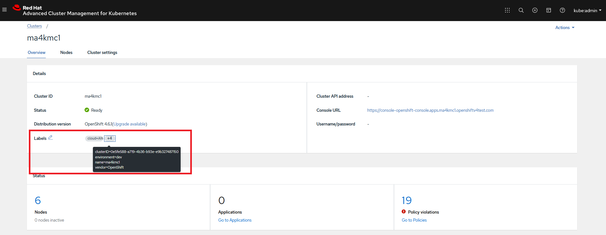

# Verification Key Setup

### Goal:
- User can setup a verification key to an ACM managed cluster.

### Prerequisite: 
- An ACM Hub Cluster and at least one ACM Managed Cluster attached to it. (already done in [prepare step](../01_tester-setup/PREPARE_TEST_ENV.md))
- A pair of GPG Keys are setup as described in [doc](../prerequisite-setup/GPG_KEY_SETUP.md). (already done in [prerequisite setup](../prerequisite-setup/GPG_KEY_SETUP.md))


### Action Steps:

 Complete the following three steps.
 
 [OC-HUB]
 
 1. Connect via `OC` to an ACM Hub cluster
    
    [Command]
    ```
    oc login --token=xxxxxxxxxxxxxxxxx  --server=https://api.hub..openshiftv4test.com:6443
    ```
    [Result]
    ```
    Logged into "https://api.hub.openshiftv4test.com:6443" as "kube:admin" using the token provided.
    You have access to 65 projects, the list has been suppressed. You can list all projects with ' projects'
    Using project "default".
    ```
   
 2. Create a new namespace in the ACM hub cluster
 
    [Command]
    ```
    oc create ns integrity-shield-operator-system
    ```
    
    [Result]
    ```
    namespace/integrity-shield-operator-system created
    ```
    
    
 3. Deploy verification key to an ACM hub cluster so that it can propagate to a managed cluster(s).

    Change the placement rule parameteter based on label used for identifying ACM managed cluster, while executing the following command
       
    Check the below example for finding the appropriate labels ACM managed cluster(s) 
       
    
    
    [Command]  
    
    ```
    curl -s  https://raw.githubusercontent.com/open-cluster-management/integrity-shield/master/scripts/ACM/acm-verification-key-setup.sh | bash -s - \
    --namespace integrity-shield-operator-system  \
    --secret keyring-secret  \
    --path /tmp/pubring.gpg \
    --label environment=dev  |  oc apply -f -
    ```
    
    [Result]
    ```
    secret/keyring-secret created
    channel.apps.open-cluster-management.io/keyring-secret-deployments created
    placementrule.apps.open-cluster-management.io/secret-placement created
    subscription.apps.open-cluster-management.io/keyring-secret created
    ```
    
### Expected Result:

 Confirm the results below after a minute.
 
 
 1. Connect via `OC` to the ACM Hub cluster and confirm a secret with name `keyring-secret` is successfully created in ACM Hub Cluster as shown below.
 
    [Command]
  
    ```
    oc get secret -n integrity-shield-operator-system keyring-secret
    ```
    
    [Result]
    ```
    NAME             TYPE     DATA   AGE
    keyring-secret   Opaque   1      26h
    ```
    
  2.  Connect via `OC` to the ACM Managed cluster and confirm a secret with name `keyring-secret` is created.
 
    [Command] 
    ```
    oc get secret -n integrity-shield-operator-system keyring-secret
    ```
    
    [Result]
    ```
    NAME             TYPE     DATA   AGE
    keyring-secret   Opaque   1      26h
    ``` 
   
