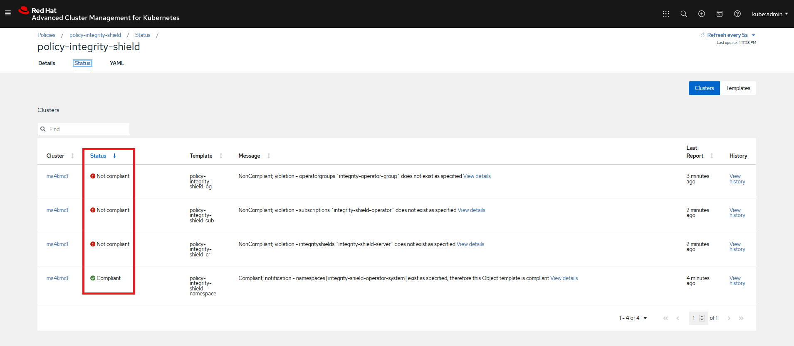

# Enable IShield Protection in an ACM Managed Cluster(s)

### Goal:
- User can enable IShield protection to an ACM managed cluster.

### Prerequisite: 
 - An ACM Hub Cluster and at least a one ACM Managed Cluster attached to it.
 - Policy collection is already cloned locally in signing host as described in [doc](../prerequisite-setup/GIT_CLONE_POLICY_COLLECTION.md)
 - Complete verification key setup in [doc](VERIFICATION_KEY_SETUP.md) (Complete this step if you have not done it in [step](VERIFICATION_KEY_SETUP.md))
 
### Action Steps:
 
 Compelete the following seven steps.
 
 [OC-HUB]
 1. Connect via oc to an ACM hub cluster
    
    [Command]
    ```
    oc login --token=xxxxxxxxxxxxxxxxx  --server=https://api.hub..openshiftv4test.com:6443
    ```
    [Result]
    ```
    Logged into "https://api.hub.openshiftv4test.com:6443" as "kube:admin" using the token provided.
    You have access to 65 projects, the list has been suppressed. You can list all projects with ' projects'
    Using project "default".
    ```
 2. Go to the directory of your cloned policy collection Git repository in the signing host

    [Command]
    ```
    cd <SIGING HOST DIR>/policy-collection
    ```
 
 3. Enable policies on an ACM managed cluster.
    
    [OC-HUB]  
    - Switch to ACM Hub cluster and create a new namespace (e.g. policy-community) in the ACM hub cluster to deploy policy-integrity-shield
    [Command]
    ```
    oc create ns policy-community
    ```
    
    [Result]
    ```
    namespace/policy-community created
    ```
    -  Create policy-integrity-shield in the ACM hub cluster in newly created namespace.
    
    [Parameters]
    - Cloned repository URL (-u): https://github.com/<YOUR-ORG-NAME>/policy-collection.git
                                  Change `<YOUR-ORG-NAME>` to your Git Organization, when executing the following command
    - Resource Prefix (-a): demo-community-policies 
    - Git Path (-p): community
    - Cluster namespace (-n) : policy-community 
 
    [Command]
    ```
    cd deploy
    bash ./deploy.sh -u https://github.com/<YOUR-ORG-NAME>/policy-collection.git -a demo-community-policies -p community -n policy-community
    ```
    
    [Result] Confirm the following resources are created
    ```
    channel.apps.open-cluster-management.io/demo-community-policies-chan created
    subscription.apps.open-cluster-management.io/demo-community-policies-sub created
    ```
    
    Above changes in Git repository will be synced by ACM Hub Cluster to update the changes in policy.
    After a minute, continue to the following steps.

 4. Confirm the policy status in  ACM Hub Web Console.
    [WebConsle-HUB]

    a. Connect to ACM Hub Cluster WebConsole and go to polices page.
    b. Search for `policy-integrity-shield` in Find Policies as shown below:
    
    
    
    
    c. Click `policy-integrity-shield` policy.
    d. Check if `policy-integrity-shield` is in violation  state (Cluster violation -> red) as shown below.
    
    
     
    e. Click status tab in policy-integrity-shield policy page and confirm the violation as below:
       
    

   
 5. Edit `community/CM-Configuration-Management/policy-integrity-shield.yaml`
    
    a. change remediationAction from `inform` to `enforce` as shown below
    
    
    
    b. configure the placement rule to select which ACM managed cluster(s) in which IShiled should be enabled.
    
    
    
    Check the below example for finding the appropriate labels ACM managed cluster(s) 
       
    
    
 6. Edit `community/CM-Configuration-Management/policy-integrity-shield-events.yaml`
 
    a. configure the placement rule to select which ACM managed cluster(s) in which IShiled should be enabled.
    
    
    
    Check the below example for finding the appropriate labels ACM managed cluster(s) 
       
    
 
 7. Sign `community/CM-Configuration-Management/policy-integrity-shield.yaml` policy
 
    [Command]
    ```
    curl -s  https://raw.githubusercontent.com/open-cluster-management/integrity-shield/master/scripts/gpg-annotation-sign.sh | bash -s -\
        signer@enterprise.com \
        community/CM-Configuration-Management/policy-integrity-shield.yaml
    ```
 8. Sign `community/CM-Configuration-Management/policy-integrity-shield-events.yaml` policy
 
    [Command]
    ```
    curl -s  https://raw.githubusercontent.com/open-cluster-management/integrity-shield/master/scripts/gpg-annotation-sign.sh | bash -s \
        signer@enterprise.com \
        community/CM-Configuration-Management/policy-integrity-shield-events.yaml
    ```
 9. Check if two annotations started with "integrityshield.io" are attached to the policy files
    a. check `community/CM-Configuration-Management/policy-integrity-shield.yaml`
 
    [Command]
    ```
    cat community/CM-Configuration-Management/policy-integrity-shield.yaml | grep 'integrityshield.io/' | wc -l
    ```
    [Result]
    ```
    7
    ```
    b. check `community/CM-Configuration-Management/policy-integrity-shield-events.yaml`
    [Command]
    ```
    cat community/CM-Configuration-Management/policy-integrity-shield-events.yaml | grep 'integrityshield.io/' | wc -l
    ```
    [Result]
    ```
    8
    ```    
 6. Commit your changes in `community/CM-Configuration-Management/policy-integrity-shield.yaml` to your cloned policy-collection git repository.

    [Command]
    ```
    git add community/CM-Configuration-Management/policy-integrity-shield.yaml
    git add community/CM-Configuration-Management/policy-integrity-shield-events.yaml
    git commit -m 'policy-integrity-shield.yaml and policy-integrity-shield-events.yaml  with signature'
    git push origin master
    ```

    
### Expected Result:
 
Above changes in Git repository will be synced by ACM Hub Cluster to update the changes in policy.
After a minute, continue to check the expected results.

 1. Confirm polices are successfully created in ACM Hub Cluster
    - Connect to ACM Hub Cluster WebConsole and go to polices page.
    - Search for `policy-integrity-shield`  in Find Policies.  
    - Check if  policy-integrity-shield policy is in compliant state (Cluster violation -> green)

     
    
    - Click  `policy-integrity-shield`  policy and go to status page. 
    - Check the complaint status which means Integrity Shield is successfully enabled in selected ACM managed clusters.
    
     
    
 2. Confirm IShield is successfully enabled in ACM Managed Cluster(s)
 
    [OC-MANAGED]
    
    Switch to ACM Hub cluster and, run the following `OC` command
    [Command]
    ```
    oc get pod -n integrity-shield-operator-system
    ```
    
    [Result]
    ```
    NAME                                                           READY   STATUS    RESTARTS   AGE
    integrity-shield-operator-controller-manager-588ddcffb-cvr8q   1/1         Running   0      26h
    integrity-shield-server-69bd97774-4ztf8                        2/2         Running   0      26h
    ```

 
 
