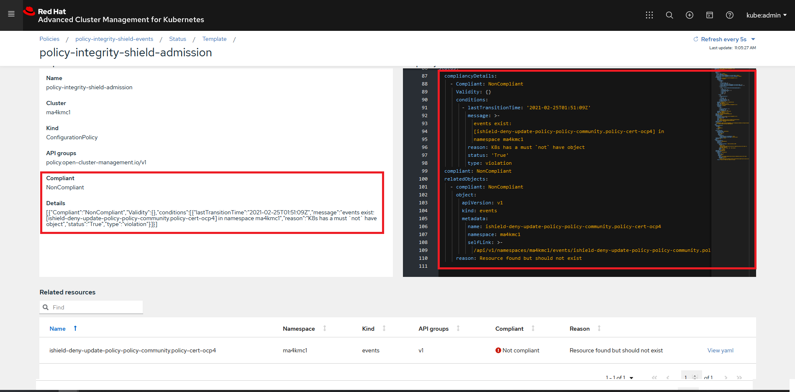

# Change a Policy without Signature

## Goal:
- User can not update a policy deployed in an ACM Hub/Managed Clusters without a proper signature  attached.

## Prerequisite: 
- Policy collection is already clone locally in signing host (already done in [prerequisite-step](../prerequisite-setup/GIT_CLONE_POLICY_COLLECTION.md))
- Integrity Shield protection is enabled (already done in [install-scenarios-step](../01_install-scenarios/02_ENABLE_ISHIELD.md))
 
## Action Steps:

Complete the following three steps:

### 1. Go to the directory of your cloned policy collection Git repository in the signing host

   [Command]
   ```
   cd <SIGING HOST DIR>/policy-collection
   ```
   
   
### 2. Edit the policy file `community/SC-System-and-Communications-Protection/policy-ocp4-certs.yaml`
   
   In line 52, change `minimumDuration` from `400h` to `500h`

   [Result]
   ```
   cat community/SC-System-and-Communications-Protection/policy-ocp4-certs.yaml| grep minimumDuration | head -n 1
   500h
   ```
   
### 3. Commit your changes in policy-ocp4-certs.yaml to your cloned policy-collection git repository.

   [Command]
   ```
   git add community/SC-System-and-Communications-Protection/policy-ocp4-certs.yaml
   git commit -m 'policy-ocp4-certs.yaml with out signature'
   git push origin master
   ```
   
 
   
## Expected Result:

continue to check the expected results after a minute (Above changes in Git repository will be synced by ACM Hub Cluster to update the changes in policy.)
    
[WebConsle-HUB]

1. Connect to ACM Hub Cluster WebConsole and go to polices page.
2. Search for `policy-integrity-shield-events`  in Find Policies.  
3. Click  `policy-integrity-shield-events`  policy. 
4. Check if  policy-integrity-shield-events  is in violation state (Cluster violation -> red) as show below.
     
  
    
5. Click  status tab in `policy-integrity-shield-events`  policy page and confirm the violation as below:
    
   In the template list
   - `policy-integrity-shield-admission` - `Not compliant`

   
  
6. Click  View details link in the violation entry listed and check details page for violations message as below.
  
   Confirm the following status
   - `Compliant` - `NonCompliant`
   - `Details` - `events exist: ishield-deny-update-policy-policy-community.policy-cert.ocp4` is found the in `json` message.
  
    
   
[OC-MANAGED]

7. Check IShield block events in via OC commands in the ACM Managed Cluster.

   Run the following command to see the blocking events generated by Integrity Shield.
   
   [Command]
   ```
   oc get events --all-namespaces  --field-selector type=IntegrityShield
   ```
   
   [Result]
   
   Confirm at least one event that contains a message `Signature Verification requrid for this request, but no signature is found. Please attach a valid signature.`, is found in the event list in the console as shown below.
   
   
