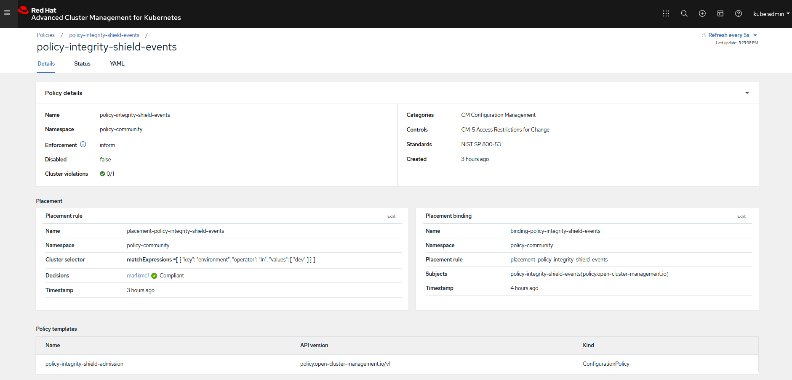
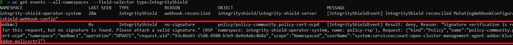

# Change a Policy with Signature

### Goal:
- User can not update a policy deployed in an ACM Hub/Managed Clusters without a proper signature  attached.

### Prerequisite: 
- Policy collection is already cloned locally in signing host as described in [doc](../prerequisite-setup/GIT_CLONE_POLICY_COLLECTION.md)
- IShield protection is enabled as described in [doc](../install-scenarios/DEPLOY_ISHIELD.md), completed this step if you have done yet, before proceeding.
 
### Action Steps:

Complete the following five steps:

1. Go to the directory of your cloned policy collection Git repository in the signing host

   [Command]
   ```
   cd <SIGING HOST DIR>/policy-collection
   ```
   
2. Edit the policy file `community/SC-System-and-Communications-Protection/policy-ocp4-certs.yaml`
   
   In line 52, change `minimumDuration` from current value to different one (e.g. `600h`)

   [Command]
   ```
   cat community/SC-System-and-Communications-Protection/policy-ocp4-certs.yaml| grep minimumDuration | head -n 1
   ```
   [Result]
   ```
   600h
   ```
    
3. Sign `community/SC-System-and-Communications-Protection/policy-ocp4-certs.yaml` policy
 
    ```
    curl -s  https://raw.githubusercontent.com/open-cluster-management/integrity-shield/master/scripts/gpg-annotation-sign.sh | bash -s \
        signer@enterprise.com \
        community/SC-System-and-Communications-Protection/policy-ocp4-certs.yaml
    ```
4. Check if two annotations started with "integrityshield.io" are attached to community/CM-Configuration-Management/policy-integrity-shield.yaml
 
    [Command]
    ```
    cat community/SC-System-and-Communications-Protection/policy-ocp4-certs.yaml | grep 'integrityshield.io/' | wc -l
    ```
    [Result]
    ```
    3
    ```
    
5. Commit your changes in policy-ocp4-certs.yaml to your cloned policy-collection git repository.

   [Command]
   ```
   git add community/SC-System-and-Communications-Protection/policy-ocp4-certs.yaml
   git commit -m 'policy-ocp4-certs.yaml with signature'
   git push origin master
   ```
   
   [Result]
   
   ```
    [master 52551a8] policy-ocp4-certs.yaml with signature
    1 file changed, 124 insertions(+), 116 deletions(-)
    rewrite community/SC-System-and-Communications-Protection/policy-ocp4-certs.yaml (75%)
    ...
    93fa995..52551a8  master -> master
   ```


   
   
### Expected Result:

Above changes in Git repository will be synced by ACM Hub Cluster to update the changes in policy.  
After a minute, continue to check the expected results.
    
[WebConsle-HUB]

1. Connect to ACM Hub Cluster WebConsole and go to polices page.
2. Search for `policy-integrity-shield-events`  in Find Policies.  
3. Click  `policy-integrity-shield-events`  policy. 
4. Check if  policy-integrity-shield-events  is in compliant state (Cluster violation -> green) as show below.
     
  
    
5. If `policy-integrity-shield-events`  is in violation state (Cluster violation -> red)
    follow the below steps to delete previous violation events from managed cluster.
    once the previous blocking events are removed, check if  policy-integrity-shield-events  is in compliant state.
   
[OC-MANAGED]

7. Check IShield block events in via OC commands in the ACM Managed Cluster.

   Run the following command to see the blocking events generated by Integrity Shield.
   
   [Command]
   ```
   oc get events --all-namespaces  --field-selector type=IntegrityShield
   ```
   
   [Result]
   
  

   Run the following command to delete blocking events generated by Integrity Shield.
   
   [Command] 
   ```
   oc get events --all-namespaces -o json --field-selector type=IntegrityShield | jq '.items[]' | jq -r '.metadata.name+" -n "+.metadata.namespace' | xargs kubectl delete events

   ```
