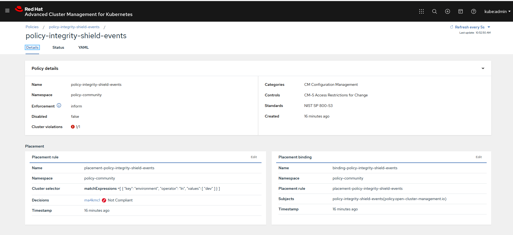
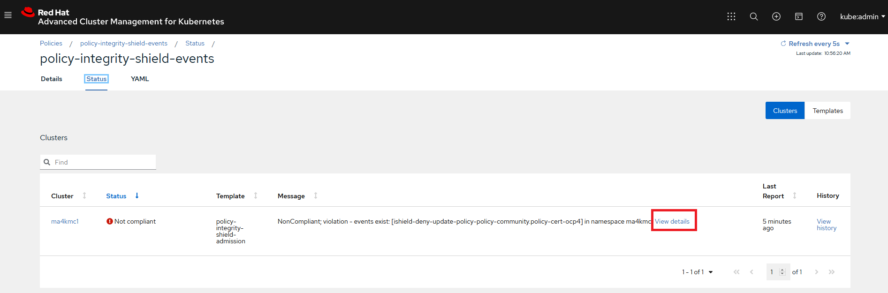
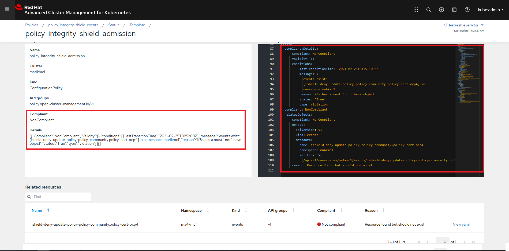
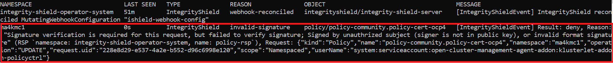

# Change a Policy with Signature, with invalid signer.

### Goal:
- User can not update a policy deployed in an ACM Hub/Managed Clusters without a valid signature  attached.

### Prerequisite: 
- Policy collection is already cloned locally in signing host (already done in [prerequisite-setup-step](../prerequisite-setup/GIT_CLONE_POLICY_COLLECTION.md))
- Integrity Shield protection is enabled  (already done in [install-scenarios-step](../install-scenarios/DEPLOY_ISHIELD.md))

### Action Steps:

Complete the following six steps:

1. Create a another signer key (with different email address e.g. `invalid_signer@enterprise.com`) as described in [doc](../prerequisite-setup/GPG_KEY_SETUP.md)
   
   This signer key must be different from the one setup in [install-scenarios-step] (../install-scenarios/VERIFICATION_KEY_SETUP.md).
   
2. Go to the directory of your cloned policy collection Git repository in the signing host

   [Command]
   ```
   cd <SIGING HOST DIR>/policy-collection
   ```
   
3. Edit the policy file `community/SC-System-and-Communications-Protection/policy-ocp4-certs.yaml`
   
   In line 52, change `minimumDuration` from current value to different one (e.g. `700h`)

   Confirm your changes are saved in file:
   
   [Command]
   ```
   cat community/SC-System-and-Communications-Protection/policy-ocp4-certs.yaml| grep minimumDuration | head -n 1

   ```
   [Result]
   ```
   700h
   ```
    
4. Run the following command to sign `community/SC-System-and-Communications-Protection/policy-ocp4-certs.yaml` policy 
    
    **Pass `invalid_signer@enterprise.com` as parameter** when executing the following command
    
    [Command]
    ```
    curl -s  https://raw.githubusercontent.com/open-cluster-management/integrity-shield/master/scripts/gpg-annotation-sign.sh | bash -s \
        invalid_signer@enterprise.com \
        community/SC-System-and-Communications-Protection/policy-ocp4-certs.yaml
    ```
5. Run the following command

    Confirm two annotations started with "integrityshield.io" are attached to `community/CM-Configuration-Management/policy-integrity-shield.yaml`
    
    [Command]
    ```
    cat community/SC-System-and-Communications-Protection/policy-ocp4-certs.yaml | grep 'integrityshield.io/' | wc -l
    ```
    [Result]
    ```
    3
    ```
    
6. Commit your changes in `policy-ocp4-certs.yaml` to your cloned policy-collection git repository.

   [Command]
   ```
   git add community/SC-System-and-Communications-Protection/policy-ocp4-certs.yaml
   git commit -m 'policy-ocp4-certs.yaml with signature`
   git push origin master
   ```
   
   
### Expected Result:

Continue to check the expected results after a minute (Above changes in Git repository will be synced by ACM Hub Cluster to update the changes in policy.)
    
[WebConsle-HUB]

1. Connect to ACM Hub Cluster WebConsole and go to polices page.
2. Search for `policy-integrity-shield-events`  in Find Policies.  
3. Click  `policy-integrity-shield-events`  policy. 
4. Check if  policy-integrity-shield-events  is in violation state (Cluster violation -> red) as show below.
     
  
    
5. Click  status tab in policy-integrity-shield-events policy page and confirm the violation as below:

   Confirm the following status in the template list
   - `policy-integrity-shield-admission` - `Not compliant`
  
  
   
6. Click  View details link in the violation entry listed and check details page for violations message as below.

  Confirm the following status
  - `Compliant` - `NonCompliant`
  - `Details` - `events exist: ishield-deny-update-policy-policy-community.policy-cert.ocp4 is found the in json message`
  
  
  
 
  
[OC-MANAGED]

7. Check Integrity Shield violation events in via OC commands in the ACM Managed Cluster.

   Run the following command to see the violation events generated by Integrity Shield.
   
   [Command]
   ```
   oc get events --all-namespaces  --field-selector type=IntegrityShield
   ```
   
   [Result]
   
   Confirm at least one event that contains a message `Signature Verification requrid for this request, but failed to verify singature; Signed by unauthorized subject (signer is not in public key) or invalid format signature.` is found in the event list in the console as shown below.
   
   

   
