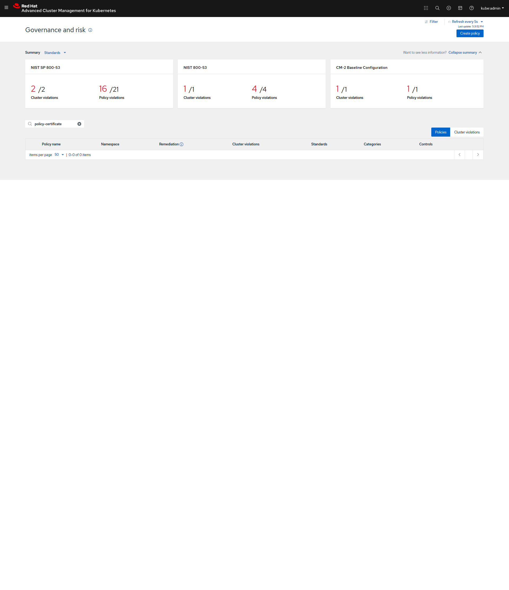

# Change a Policy with Signature

## Goal:
- User can deploy [stable policies](https://github.com/open-cluster-management/policy-collection/tree/master/stable) in an ACM Hub/Managed Clusters with valid signatures attached.

## Prerequisite: 
- Policy collection is already cloned locally in signing host (already done in [prerequisite-setup-step](../prerequisite-setup/GIT_CLONE_POLICY_COLLECTION.md))
- Integrity Shield protection is enabled (already done in [install-scenarios-step](../install-scenarios/DEPLOY_ISHIELD.md)). 
 
## Action Steps:

Compelete the following seven steps:

### 1. Go to the directory of your cloned policy collection Git repository in the signing host

   [Command]
   ```
   cd <SIGING HOST DIR>/policy-collection
   ```
   
### 2. Create the following signing script under `deploy` directory in the cloned `policy-collection` repository in the host machine.

   [Command]
   ```
    cat > deploy/sign-policy.sh
    #!/bin/bash
    CMDNAME=`basename $0`
    if [ $# -ne 2 ]; then
      echo "Usage: $CMDNAME <signer> <YAML files directory>" 1>&2
      exit 1
    fi
    if [ ! -e $2 ]; then
      echo "$2 does not exist"
      exit 1
    fi
    SCRIPT_DIR=$(cd $(dirname $0); pwd)
    SIGNER=$1
    TARGET_DIR=$2
    find ${TARGET_DIR} -type f -name "*.yaml" | while read file;
      do
      
      # Uncomment the following line to keep a backup of the original policy file.
      # cp ${file} ${file}.backup
      

      curl -s https://raw.githubusercontent.com/open-cluster-management/integrity-shield/master/scripts/gpg-annotation-sign.sh | bash -s ${SIGNER} "$file"

      echo Signature annotation is attached in $file.
      done
   ```
    
   Make `deploy/sign-policy.sh` script executable.
    
   [Command]
   ```
   chmod +x deploy/sign-policy.sh
   ```
    
   Run the following script to sign all the policies in `stable` directory with signer `signer@enterprise.com`
    
   [Command]
   ```
   ./deploy/sign-policy.sh signer@enterprise.com stable/
   ```
    
    
   Confirm the following policy files under `stable` directory have been modified.
    
   [Result] 
   ```
   git status
   On branch master
   Changes not staged for commit:
    (use "git add <file>..." to update what will be committed)
    (use "git restore <file>..." to discard changes in working directory)
        modified:   stable/AC-Access-Control/policy-limitclusteradmin.yaml
        modified:   stable/AC-Access-Control/policy-role.yaml
        modified:   stable/AC-Access-Control/policy-rolebinding.yaml
        modified:   stable/CA-Security-Assessment-and-Authorization/policy-compliance-operator-install.yaml
        modified:   stable/CM-Configuration-Management/policy-compliance-operator-e8-scan.yaml
        modified:   stable/CM-Configuration-Management/policy-etcdencryption.yaml
        modified:   stable/CM-Configuration-Management/policy-gatekeeper-operator-downstream.yaml
        modified:   stable/CM-Configuration-Management/policy-limitmemory.yaml
        modified:   stable/CM-Configuration-Management/policy-namespace.yaml
        modified:   stable/CM-Configuration-Management/policy-pod.yaml
        modified:   stable/SC-System-and-Communications-Protection/policy-certificate.yaml
        modified:   stable/SI-System-and-Information-Integrity/policy-imagemanifestvuln.yaml
        modified:   stable/SI-System-and-Information-Integrity/policy-psp.yaml
        modified:   stable/SI-System-and-Information-Integrity/policy-scc.yaml
    
   ```
    
### 3.  Check if annotations are attached to a policy file. 

   For example, check if signature annotations started with "integrityshield.io" are attached to `stable/AC-Access-Control/policy-limitclusteradmin.yaml`
    
   [Command]
   ```
   cat stable/AC-Access-Control/policy-limitclusteradmin.yaml | grep 'integrityshield.io/' | wc -l
   ```
    
   [Result]
   ```
   6
   ```
    
### 4. Commit your changes in `policy-ocp4-certs.yaml` to your cloned policy-collection git repository.

   [Command]
   ```
   git add stable
   git commit -m 'stable polices have been signed`
   git push origin master
   ```
    
### 5. Switch to console connecting via `OC` to the ACM Hub cluster 

### 6. Create a new namespace (e.g. policy-stable) in the ACM hub cluster to deploy polices under stable directory.
    
   [Command]
   ```
   oc create ns policy-stable
   ```
    
   [Result]
   ```
   namespace/policy-stable created
   ```
    
### 7. Create policies under stable directory in the ACM hub cluster in the newly created namespace `policy-stable`.
    
   Change `<YOUR-ORG-NAME>` to your Git Organization and use the URL that starts with `https://github.com` and pass it as parameter: `Cloned repository URL (-u)`, when executing the following command
 
   [Command]
   ```
   cd deploy
   bash ./deploy.sh -u https://github.com/<YOUR-ORG-NAME>/policy-collection.git -a demo-stable-policies -p stable -n policy-stable
   ```
    
   Confirm the following resources are created
    
   [Result]
   ```
   channel.apps.open-cluster-management.io/demo-stable-policies-chan created
   subscription.apps.open-cluster-management.io/demo-stable-policies-sub created
   ```

## Expected Result:

Continue to check the expected results after a minute (Above changes in Git repository will be synced by ACM Hub Cluster to update the changes in policy.)
    
[WebConsle-HUB]

1. Connect to ACM Hub Cluster WebConsole and go to polices page.
2. Search for `policy-certificate`  in Find Policies.  
3. Click  `policy-certificate`  policy. 
4. Check if  `policy-certificate` is in compliant state (Cluster violation -> green) as show below.
     
  
    


