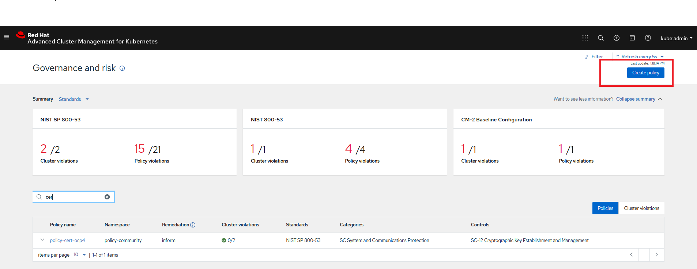

# Create a policy via UI with signature annotation

### Goal:
- User can create a policy via UI with signature annotation

### Prerequisite: 
- IShield protection is enabled as described in [doc](../install-scenarios/DEPLOY_ISHIELD.md)

### Action Steps:

[Hub WebConsole]

1. Go to ACM Hub Multicluster WebConsole and change to click `Go to Governance and Risk`

2. Click `Create policy` as shown below.

  
 
3. Fill in the necessary information highlighted below
  
 
 
4. A sample test policy would like as below (filled in values are highlighed)
 
 
 
5. Save the YAML content of final policy to be created to a local file in Signing Host.
 
 [Result]
 ```
 cat /tmp/policy-test-ui.yaml
 apiVersion: policy.open-cluster-management.io/v1
 kind: Policy
 metadata:
   name: policy-namespace
   namespace: policy-community
   annotations:
     policy.open-cluster-management.io/standards: NIST-CSF
     policy.open-cluster-management.io/categories: PR.IP Information Protection Processes and Procedures
     policy.open-cluster-management.io/controls: PR.IP-1 Baseline Configuration
 spec:
   remediationAction: enforce
   disabled: false
   policy-templates:
   - objectDefinition:
       apiVersion: policy.open-cluster-management.io/v1
       kind: ConfigurationPolicy
       metadata:
         name: policy-namespace-prod
       spec:
         remediationAction: inform # will be overridden by remediationAction in parent policy
         severity: low
         namespaceSelector:
           exclude: ["kube-*"]
           include: ["default"]
         object-templates:
           - complianceType: musthave
             objectDefinition:
               kind: Namespace # must have namespace 'prod'
               apiVersion: v1
               metadata:
                 name: prod
 ---
 apiVersion: policy.open-cluster-management.io/v1
 kind: PlacementBinding
 metadata:
   name: binding-policy-namespace
   namespace: policy-community
 placementRef:
   name: placement-policy-namespace
   kind: PlacementRule
   apiGroup: apps.open-cluster-management.io
 subjects:
 - name: policy-namespace
   kind: Policy
   apiGroup: policy.open-cluster-management.io
 ---
 apiVersion: apps.open-cluster-management.io/v1
 kind: PlacementRule
 metadata:
   name: placement-policy-namespace
   namespace: policy-community
 spec:
   clusterConditions:
   - status: "True"
     type: ManagedClusterConditionAvailable
   clusterSelector:
     matchExpressions:
       - {key: environment, operator: In, values: ["dev"]}
 ```
 
6. Sign ` /tmp/policy-test-ui.yaml` policy
 
  [Command]
  ```
    curl -s  https://raw.githubusercontent.com/open-cluster-management/integrity-shield/master/scripts/gpg-annotation-sign.sh | bash -s \
        signer@enterprise.com \
        /tmp/policy-test-ui.yaml
  ```
  
7. Check if two annotations started with "integrityshield.io" are attached to  /tmp/policy-test-ui.yaml  

  [Result]
  ```
  cat /tmp/policy-test-ui.yaml | grep 'integrityshield.io/' | wc -l
  6 
  ```
  
8. Copy the content of signed policy file /tmp/policy-test-ui.yaml back to UI edit as shown below.

  
  
9. Click create as shown below

  
  
  
   
### Expected Result:

    Above changes in Git repository will be synced by ACM Hub Cluster to update the changes in policy.  
    After a minute, continue to check the expected results.
    
    
[WebConsle-HUB]

1. Connect to ACM Hub Cluster WebConsole and go to polices page.
2. Search for `policy-namespace`  in Find Policies and click  `policy-namespace`  policy. 
4. Check if  `policy-namespace` is in compliant state (Cluster violation -> green) as show below.
     
    
 
 
