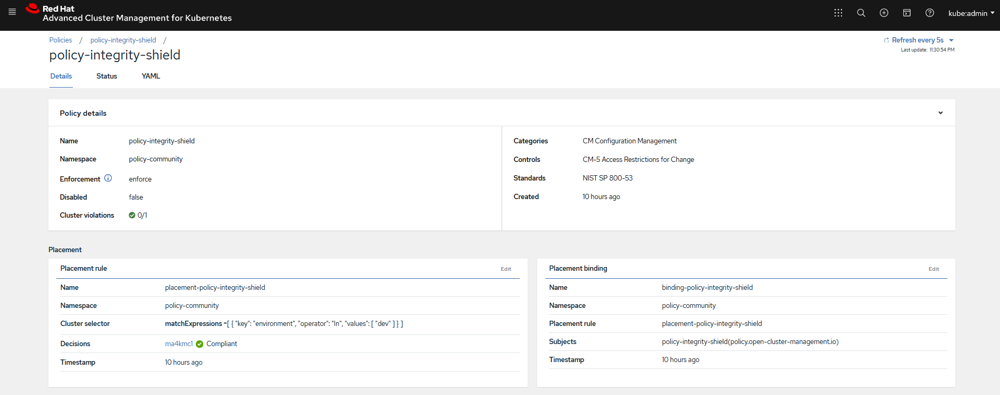
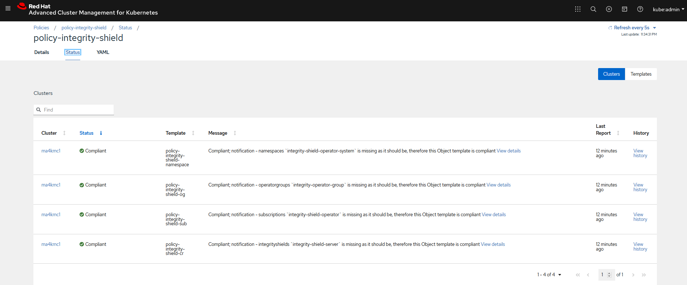

# Disable IShield in an ACM Managed Cluster

## Goal:
- User can disable IShield protection to an ACM managed cluster.

## Prerequisite: 
- Policy collection is already cloned locally in signing host (already done in [doc](../prerequisite-setup/GIT_CLONE_POLICY_COLLECTION.md))
- Integrity Shield protection is enabled (already done in [doc](../install-scenarios/DEPLOY_ISHIELD.md))
 
## Action Steps:

Complete the following seven steps:

### 1. Go to the directory of your cloned policy collection Git repository in the signing host.

   [Command]
   ```
   cd <SIGING HOST DIR>/policy-collection
   ```
### 2. Edit `community/CM-Configuration-Management/policy-integrity-shield.yaml`
   Change all occurances of  `musthave` to `mustnothave`
   
### 3. Run the following command to sign policy with signer `signer@enterprise.com`
 
   [Command]
   ```
    curl -s  https://raw.githubusercontent.com/open-cluster-management/integrity-shield/master/scripts/gpg-annotation-sign.sh | bash -s \
        signer@enterprise.com \
        community/CM-Configuration-Management/policy-integrity-shield.yaml
   ```
    
### 4. Run the following command

   Confirm annotations started with "integrityshield.io" are attached to `community/CM-Configuration-Management/policy-integrity-shield.yaml`
   
   [Command]
   ```
   cat community/CM-Configuration-Management/policy-integrity-shield.yaml | grep 'integrityshield.io/' | wc -l
  
   ```
    
   [Result]
   ```
   7
   ```
    
5. Commit your changes in `policy-integrity-shield.yaml` to your cloned policy-collection git repository.

   [Command]
   ```
   git add community/CM-Configuration-Management/policy-integrity-shield.yaml
   git commit -m 'policy-integrity-shield.yaml with signature'
   git push origin master
   ```   

6  Switch to your console connecting via `OC` to ACM Hub Cluster and continue the step.
 
7. Run the following command to remove verification key from ACM HUB/Managed Clusters
   
   Change the placement rule parameteter based on label used for identifying ACM managed cluster, while executing the following command
       
   Check the below example for finding the appropriate labels ACM managed cluster(s) 
       
   
    
   [Command]
   ```
    curl -s  https://raw.githubusercontent.com/open-cluster-management/integrity-shield/master/scripts/ACM/acm-verification-key-setup.sh | bash -s - \
    --namespace integrity-shield-operator-system  \
    --secret keyring-secret  \
    --path /tmp/pubring.gpg \
    --label environment=dev  |  oc delete -f -
   ```
   
   Confirm following resources are created.
   
   [Result]
   ```
    secret/keyring-secret deleted
    channel.apps.open-cluster-management.io/keyring-secret-deployments deleted
    placementrule.apps.open-cluster-management.io/secret-placement deleted
    subscription.apps.open-cluster-management.io/keyring-secret deleted
   ```
  
### Expected Result:

Continue to check the expected results after a minute (Above changes in Git repository will be synced by ACM Hub Cluster to update the changes in policy.)
    
[WebConsle-HUB]

1. Connect to ACM Hub Cluster WebConsole and go to polices page.
2. Search for `policy-integrity-shield`  in Find Policies and click  `policy-integrity-shield`  policy. 
3. Check if  `policy-integrity-shield`  is in compliant state (Cluster violation -> green) as show below.



4. Click status tab in policy-integrity-shield policy page and confirm the compliant as below:
   Confirm the following status in the Templates List shown below:
   - `policy-integrity-shield-og` - `Compliant`
   - `policy-integrity-shield-sub` - `Compliant`
   - `policy-integrity-shield-cr` - `Compliant`
   - `policy-integrity-shield-namespace` - `Compliant`
   


4. Switch to your console connecting via `OC` to ACM Managed Cluster and continue the step.

5. Check if IShield components are removed in in the ACM Managed Cluster via OC commands.
   
   [Command]
   ```
   oc get pod -n integrity-shield-operator-system
   ```
   
   Confirm `No Resource Found` message
   
   [Result]
   ```
   No resources found in integrity-shield-operator-system namespace.
   ```


